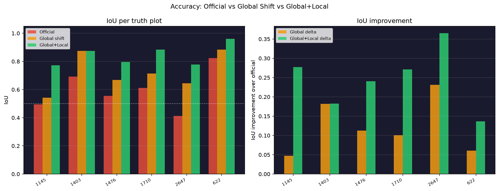

# Accuracy Report

Scored against 6 public example truths. The hidden grading set is larger.

## Pipeline stages

| Stage | Median IoU | Centroid error | Plots improved |
|---|---|---|---|
| Official (baseline) | 0.584 | — | — |
| + Global shift (-4.4m, +11.4m) | 0.691 | 7.8m | 6/6 |
| + Local boundary+image refinement | 0.836 | 3.4m | 6/6 over global |

## Per-truth plot breakdown

| Plot | IoU off | IoU global | IoU final | delta global | delta local | Centroid err |
|---|---|---|---|---|---|---|
| 622 | 0.824 | 0.884 | 0.960 | +0.061 | +0.076 | 1.8m |
| 1710 | 0.612 | 0.713 | 0.883 | +0.101 | +0.170 | 3.3m |
| 1403 | 0.693 | 0.875 | 0.875 | +0.182 | +0.001 | 4.6m |
| 1476 | 0.556 | 0.668 | 0.796 | +0.112 | +0.128 | 0.9m |
| 2647 | 0.414 | 0.645 | 0.778 | +0.231 | +0.133 | 5.6m |
| 1145 | 0.495 | 0.542 | 0.772 | +0.048 | +0.230 | 3.6m |
| **MEDIAN** | **0.584** | **0.691** | **0.836** | **+0.107** | **+0.145** | **3.4m** |

## Key findings

- Global shift improves median IoU by **+0.107** (6/6 plots).
- Local refinement adds **+0.145** further (6/6 over global).
- Final median centroid error: **3.4m**.
- All 6 truth plots achieve IoU ≥ 0.5.

