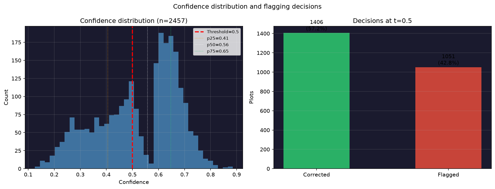
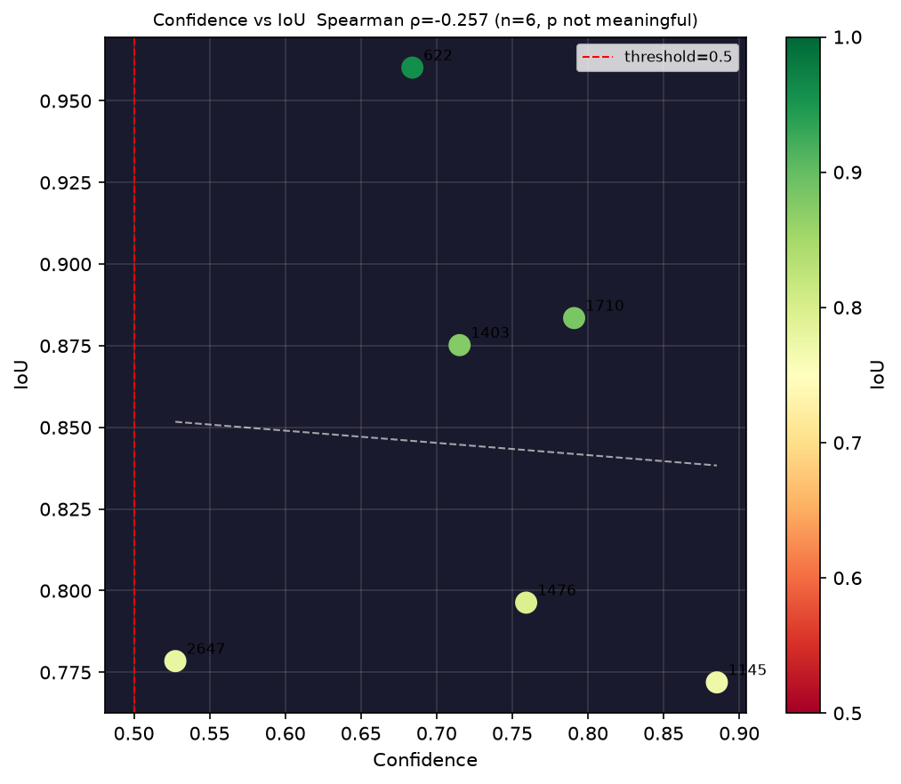
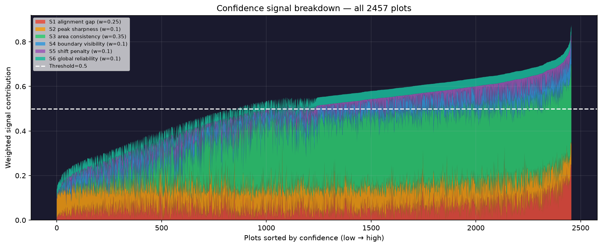

# Calibration Report

## Confidence statistics (all 2457 plots)

| Statistic | Value |
|---|---|
| Min | 0.126 |
| p25 | 0.406 |
| Median | 0.557 |
| p75 | 0.647 |
| Max | 0.885 |
| Mean | 0.522 |
| Std  | 0.156 |

## Confidence vs IoU on truth plots

Spearman ρ = **-0.257** (p = 0.623)

> With n=6, the p-value is not interpretable. The hidden test set is the real calibration test.

| Plot | Confidence | IoU | Accurate (≥0.5) |
|---|---|---|---|
| 1145 | 0.885 | 0.772 | ✓ |
| 1710 | 0.791 | 0.883 | ✓ |
| 1476 | 0.759 | 0.796 | ✓ |
| 1403 | 0.715 | 0.875 | ✓ |
| 622 | 0.684 | 0.960 | ✓ |
| 2647 | 0.527 | 0.778 | ✓ |

## Signal weights

| Signal | Weight | Description |
|---|---|---|
| S1 alignment gap | 0.25 | Boundary score improvement global→local |
| S2 peak sharpness | 0.1 | Z-score of best vs all candidates |
| S3 area consistency | 0.35 | Predicted area vs recorded total |
| S4 boundary visibility | 0.1 | Edge density vs village median |
| S5 shift penalty | 0.1 | Penalise large local corrections |
| S6 global reliability | 0.1 | Spread of drift across truth plots |
| S7 neighbourhood | 0.08 blended | IDW consistency with nearby corrected plots |

S3 carries the highest weight — it is the only signal independent of imagery quality.

