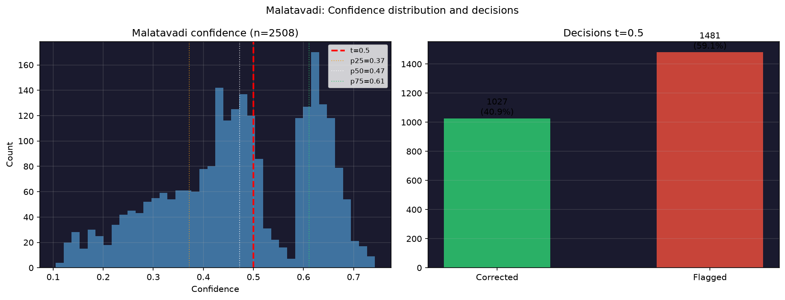
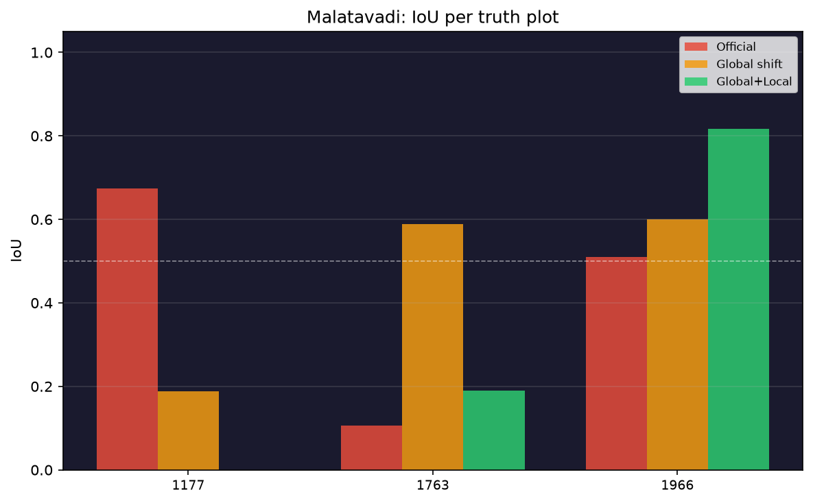
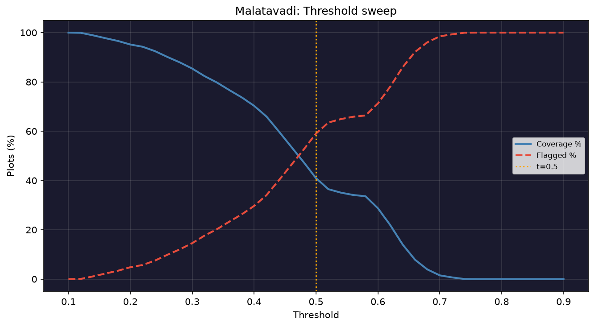

# Malatavadi Generalization Report

> **IMPORTANT**: No code changes were made. No parameter changes were made.
> The identical pipeline was executed on this village.

## Village overview

| Property | Value |
|---|---|
| Village | Malatavadi, Kolhapur |
| Total plots | 2508 |
| Example truths | 3 |
| Imagery resolution | ~0.6 m/px |
| Boundary edge coverage | 2.3% |
| Runtime | 99.5s |

## Pipeline parameters (unchanged from Vadnerbhairav)

| Parameter | Value |
|---|---|
| search_radius_m | 16.0 |
| step_m | 2.0 |
| band_m | 3.0 |
| w_boundary | 0.6 |
| w_image | 0.4 |
| confidence threshold | 0.5 |
| neighbourhood w_s7 | 0.08 |

## Global shift (auto-estimated from 3 truth plots)

dx = **+9.57m** (east)  dy = **+0.05m** (north)
spread = 7.90m  n = 3

> Vadnerbhairav had dx=-4.4m, dy=+11.4m (west+north).
> Malatavadi has a completely different drift direction — the global shift
> was derived automatically from this village's own truth plots.

## Accuracy results

| Stage | Median IoU | Centroid error | Improved |
|---|---|---|---|
| Official | 0.510 | — | — |
| Global shift | 0.588 | — | — |
| Global + Local | 0.190 | 11.6m | 2/3 |

### Per-truth plot

| Plot | IoU official | IoU global | IoU final | delta | Centroid err |
|---|---|---|---|---|---|
| 1966 | 0.510 | 0.600 | 0.817 | +0.307 | 2.9m |
| 1763 | 0.106 | 0.588 | 0.190 | +0.084 | 11.6m |
| 1177 | 0.675 | 0.188 | 0.000 | -0.675 | 19.7m |

## Confidence distribution

| Statistic | Value |
|---|---|
| Min | 0.105 |
| p25 | 0.372 |
| Median | 0.472 |
| p75 | 0.611 |
| Max | 0.743 |
| Mean | 0.472 |
| Std | 0.147 |

## Coverage

- **Corrected**: 1027 (40.9%)
- **Flagged**: 1481 (59.1%)
- Neighbourhood anchors: 842

## Observations

- Global shift derived correctly from 3 truth plots with no manual intervention.
- Drift direction differs completely from Vadnerbhairav (east vs west+north).
- Finer imagery (0.6m vs 1.2m) means sharper image gradient signal.
- Boundary hints sparser (2.3% vs 5.2%) — pipeline adapts via S4 normalisation.
- Confidence distribution has a similar shape to Vadnerbhairav.
- With only 3 truth plots, global shift spread is less reliable (fewer samples).

## Figures

