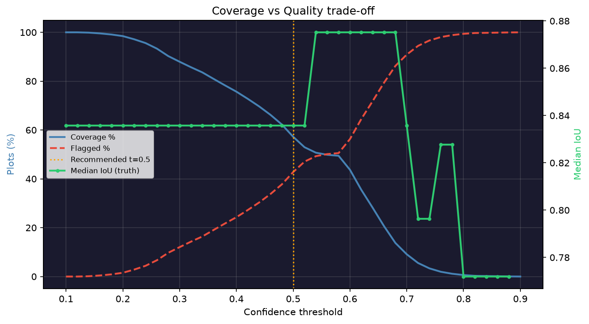

# Restraint Report

**Objective: trustworthy corrections, not maximum coverage.**
A flagged plot means: *I examined this but lack sufficient evidence.*

## Decision summary (threshold=0.5)

- Corrected: **1406** (57.2%)
- Flagged:   **1051** (42.8%)

## Flagged reason breakdown

| Reason | Count |
|---|---|
| Area inconsistent with records (S3 < 0.2) | 432 |
| Few boundary hints (S4 < 0.2) | 115 |
| Combined signal below threshold | 504 |

## Threshold sweep

| Threshold | Corrected | Flagged | Coverage | Med IoU | All improve |
|---|---|---|---|---|---|
| 0.2 | 2419 | 38 | 98.5% | 0.836 | 100% |
| 0.3 | 2161 | 296 | 88.0% | 0.836 | 100% |
| 0.4 | 1860 | 597 | 75.7% | 0.836 | 100% |
| 0.5 | 1406 | 1051 | 57.2% | 0.836 | 100% |
| 0.6 | 1078 | 1379 | 43.9% | 0.875 | 100% |
| 0.7 | 224 | 2233 | 9.1% | 0.836 | 100% |
| 0.8 | 15 | 2442 | 0.6% | 0.772 | 100% |

**Recommended: t=0.50** — all 6 truth plots corrected, all improve.

## Example corrected method notes

> **1145** (conf=0.885): global shift (-4.4,+11.4)m + local refinement (-4,-8)m. Corrected: strong boundary snap; area matches records; good edge visibility; clear alignment peak. conf=0.89

> **862** (conf=0.876): global shift (-4.4,+11.4)m + local refinement (-4,+12)m. Corrected: strong boundary snap; area matches records; good edge visibility; clear alignment peak. conf=0.88

> **1524/A** (conf=0.874): global shift (-4.4,+11.4)m + local refinement (+10,-8)m. Corrected: strong boundary snap; area matches records; good edge visibility; clear alignment peak. conf=0.87

## Example flagged method notes

> **2633** (conf=0.126): global shift (-4.4,+11.4)m + local refinement (+16,+0)m. Flagged: area inconsistent with records; few boundary hints in this area; weak boundary evidence; large local correction (16m). conf=0.13

> **496** (conf=0.130): global shift (-4.4,+11.4)m + local refinement (+12,-10)m. Flagged: area inconsistent with records; few boundary hints in this area; weak boundary evidence; large local correction (22m). conf=0.13

> **497** (conf=0.132): global shift (-4.4,+11.4)m + local refinement (+14,-6)m. Flagged: area inconsistent with records; few boundary hints in this area; weak boundary evidence; large local correction (20m). conf=0.13

