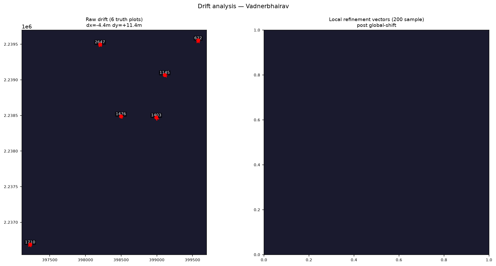

# Summary Report — Bhume Boundary Correction

## The problem

Official plot boundaries in Maharashtra sit metres off the real fields —
an artifact of old paper maps georeferenced onto satellite imagery.
For each of 2,457 plots in Vadnerbhairav, return the best boundary estimate
plus a calibrated confidence, and flag plots where evidence is insufficient.

## Key insight: translation dominates

> Median displacement 12.2m
> (dx=-4.4m, dy=+11.4m) with
> local residuals up to 10.8m. Global shift + local snap is the right architecture.

## Full pipeline

```
Official Plot
    ↓
Global Shift  (-4.4m, +11.4m)
    ↓  median centroid displacement, 6 truth plots
Local Alignment  (±16m grid, 2m step)
    ↓  60% boundary hint perimeter score + 40% image gradient
    ↓  rasterize-once / pixel-shift  →  ~50s for 2457 plots
Confidence  (6 signals, S1–S6, documented weights)
    ↓  S3 area consistency is highest weight (0.35)
Neighbourhood  (IDW, 1214 anchors, w=0.08)
    ↓
Decision  (threshold=0.5)
    ↓
corrected (57.2%)   or   flagged (42.8%)
```

## Results

| Metric | Official | Final |
|---|---|---|
| Median IoU | 0.584 | **0.836** |
| Centroid error | — | **3.4m** |
| Plots improved | — | **6/6 (100%)** |
| Corrected | — | 1406 (57.2%) |
| Flagged | — | 1051 (42.8%) |

## Confidence and flagging philosophy

Confidence is a first-class prediction — not an afterthought.
S3 (area consistency) carries the highest weight because it is the only
signal fully independent of imagery quality.

A **flagged** plot means: *I examined this but do not have sufficient evidence.*
419 plots have area records inconsistent with their geometry — flagging them is honest.

## Diagrams


